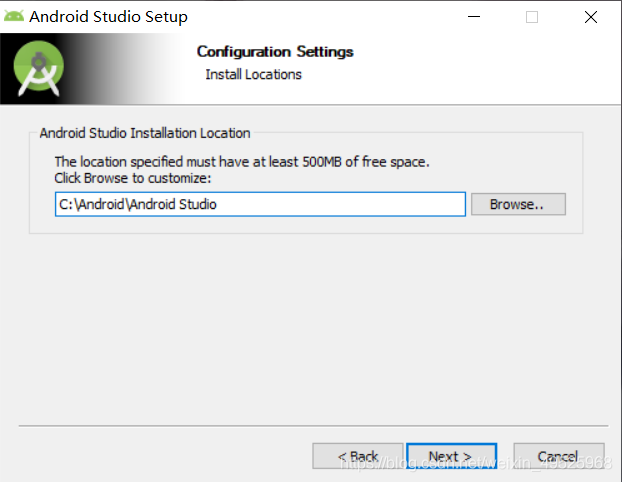

# 实验1_安装相关软件

## ①Android Studio安装

Android Studio（简称AS）是谷歌推出的一个Android集成开发工具，基于IntelliJ IDEA. 类似 Eclipse ADT，Android Studio 提供了集成的 Android 开发工具用于开发和调试。

打开安卓官网，下载Android studio安装包
AS官网：https://developer.android.google.cn/studio
AS中文社区：https://developer.android.google.cn/studio


下载后双击安装包进入安装


点击 Next 进入下一个界面


选择要安装的组件，笔者全选，点击 Next 进行下一步


选择安装目录，强烈建议不要安装在 C:\Program Files\ 等需要较高权限的目录下。单击 Next


这一步选择开始菜单文件夹，可以不管直接单击 Install 进入下一步


等待安装完成，单击 Next


单击 Finish 启动AS


询问我们是否有配置文件导入，这里直接选择不导入，点击ok


进入主界面点击next，弹出无法访问sdk，我们先点击cancel
选择安装类型，点击第二个，点击next


选择默认的jdk目录，一路next直到下载安装完成

至此Android studio安装完成

## ②Jupyter Notebook安装

简而言之，Jupyter Notebook是以网页的形式打开，可以在网页页面中直接编写代码和运行代码，代码的运行结果也会直接在代码块下显示。如在编程过程中需要编写说明文档，可在同一个页面中直接编写，便于作及时的说明和解释。

**使用pip命令安装**

以管理员身份运行“命令提示符”


安装Notebook
```
pip install notebook
```


运行Notebook

```
jupyter notebook
```


至此notebook安装完成


