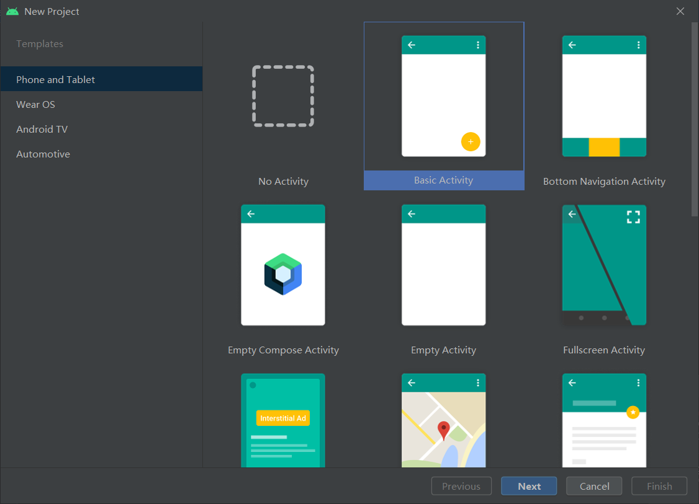
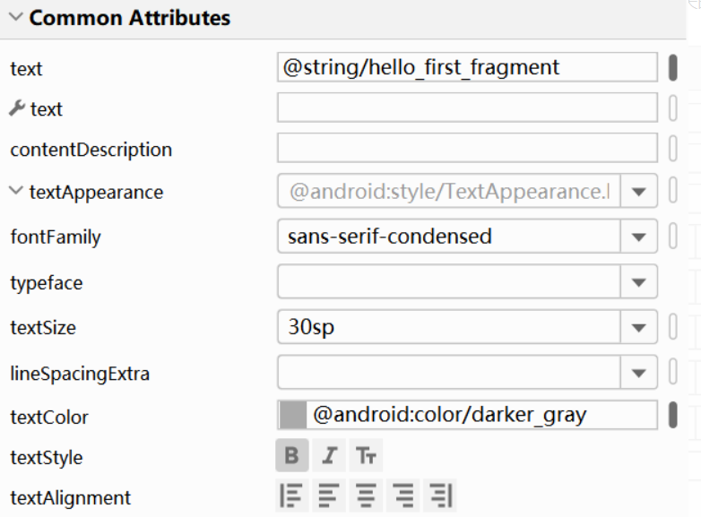
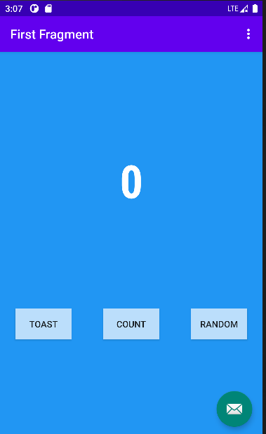
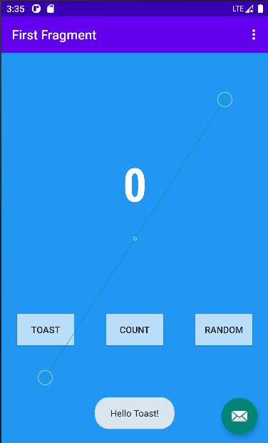
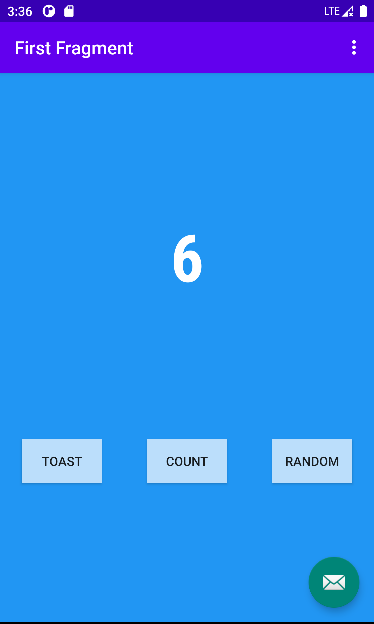
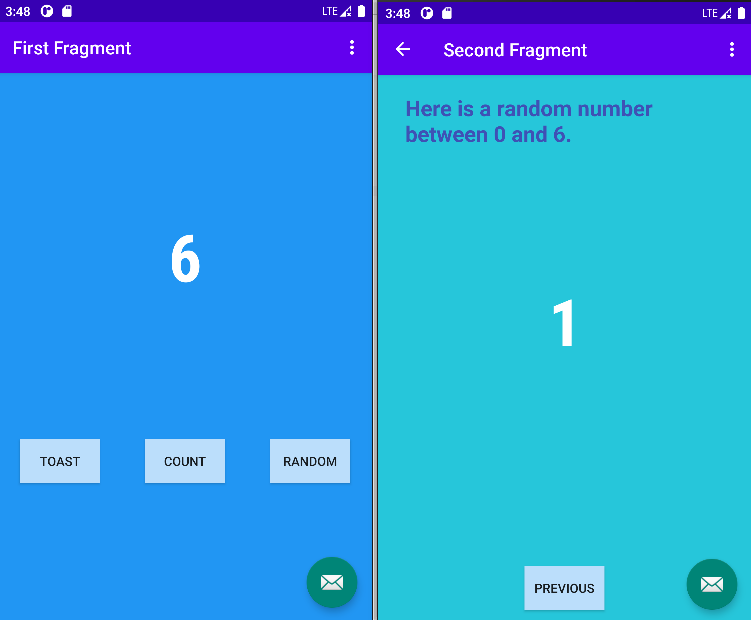
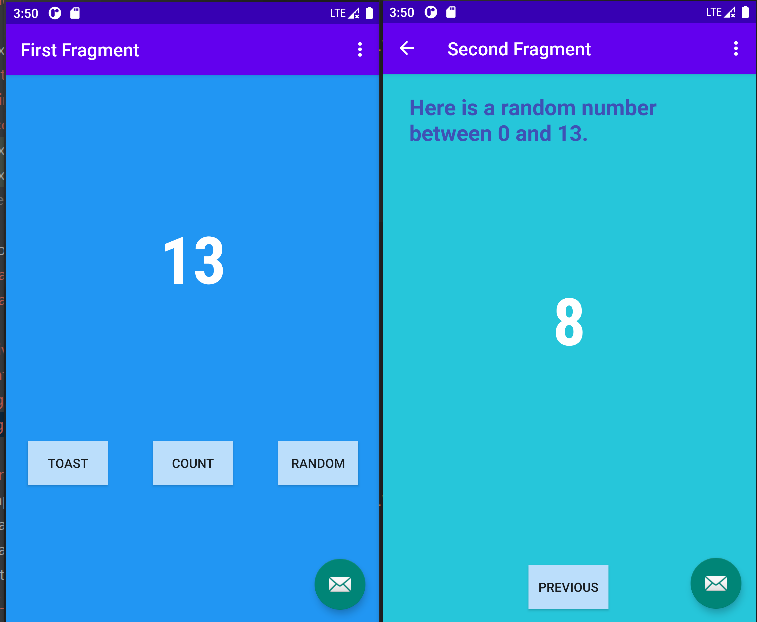

## 实验2_创建首个Kotlin应用

### 实验内容

* 安装Android Studio 4.1+以上版本，后续更好的使用
  TensorFlow Lite

* 按照[教程](https://blog.csdn.net/llfjfz/article/details/124031522)首个Kotlin交互应用
* 上传代码至Github，并撰写详细的Readme文档

### 实验目的

* 掌握Android Studio开发应用的基本流程
* 掌握Android Studio开发组件的基本用法
* 初始Kotlin语言的基本要素
* 掌握Android Navigation的基本用法

### 实验过程

#### 创建一个新的工程

打开Android Studio，选择Projects>New Project，然后选择Basic Activity.



点击Next，为应用程序命名（Exp_2），选择**Kotlin**语言，然后点击Finish。Android Studio将使用系统中最新的API Level创建应用程序，并使用Gradle作为构建系统，在底部的视窗中可以查看整个过程。

#### 修改布局编辑器

在Basic Activity中，包含了基本的导航组件，Android app关联两个fragments，第一个屏幕显示了“Hello first fragment”由FirstFragment创建，界面元素的排列由布局文件指定，文件位置:res>layout>fragment_first.xml

查看布局的代码（Code），修改Textview的**Text**属性

```xml
android:text="@string/hello_first_fragment"
```

右键该代码，选择**Go To > Declaration or Usages**，跳转到values/strings.xml，看到高亮文本

```xml
<string name="hello_first_fragment">Hello first fragment</string>
```

修改字符串属性值为“Hello Kotlin!”。更进一步，修改字体显示属性，在Design视图中选择**textview_first**文本组件，在Common Attributes属性下的textAppearance域，设置相关的文字显示属性



查看布局的XML代码，可以看到新属性被应用

```xml
android:fontFamily="sans-serif-condensed"
android:text="@string/hello_first_fragment"
android:textColor="@android:color/darker_gray"
android:textSize="30sp"
android:textStyle="bold"
```

#### fragment_first.xml添加按钮和约束完善UI组件的属性设置

添加完成后的xml

```xml
<?xml version="1.0" encoding="utf-8"?>
<androidx.constraintlayout.widget.ConstraintLayout xmlns:android="http://schemas.android.com/apk/res/android"
    xmlns:app="http://schemas.android.com/apk/res-auto"
    xmlns:tools="http://schemas.android.com/tools"
    android:layout_width="match_parent"
    android:layout_height="match_parent"
    android:background="@color/screenBackground"
    tools:context=".FirstFragment">

    <TextView
        android:id="@+id/textview_first"
        android:layout_width="wrap_content"
        android:layout_height="wrap_content"
        android:fontFamily="sans-serif-condensed"
        android:textColor="@color/white"
        android:text="0"
        android:textSize="72sp"
        android:textStyle="bold"
        app:layout_constraintVertical_bias="0.3"
        app:layout_constraintBottom_toTopOf="@id/random_button"
        app:layout_constraintEnd_toEndOf="parent"
        app:layout_constraintStart_toStartOf="parent"
        app:layout_constraintTop_toTopOf="parent" />

    <Button
        android:id="@+id/random_button"
        android:layout_width="wrap_content"
        android:layout_height="wrap_content"
        android:layout_marginEnd="24dp"
        android:background="@color/buttonBackground"
        android:text="@string/random_button_text"
        app:layout_constraintBottom_toBottomOf="parent"
        app:layout_constraintEnd_toEndOf="parent"
        app:layout_constraintTop_toBottomOf="@+id/textview_first" />

    <Button
        android:id="@+id/toast_button"
        android:layout_width="wrap_content"
        android:layout_height="wrap_content"
        android:layout_marginStart="24dp"
        android:background="@color/buttonBackground"
        android:text="@string/toast_button_text"
        app:layout_constraintBottom_toBottomOf="parent"
        app:layout_constraintStart_toStartOf="parent"
        app:layout_constraintTop_toBottomOf="@+id/textview_first" />

    <Button
        android:id="@+id/count_button"
        android:layout_width="wrap_content"
        android:layout_height="wrap_content"
        android:text="@string/count_button_text"
        android:background="@color/buttonBackground"
        app:layout_constraintBottom_toBottomOf="parent"
        app:layout_constraintEnd_toStartOf="@+id/random_button"
        app:layout_constraintStart_toEndOf="@+id/toast_button"
        app:layout_constraintTop_toBottomOf="@+id/textview_first" />
    />
</androidx.constraintlayout.widget.ConstraintLayout>
```

**运行效果**



#### TOAST按钮添加一个toast消息

打开FirstFragment.kt文件，有三个方法：onCreateView，onViewCreated和onDestroyView，在onViewCreated方法中使用绑定机制设置按钮的响应事件（创建应用程序时自带的按钮）

```kotlin
// find the toast_button by its ID and set a click listener
view.findViewById<Button>(R.id.toast_button).setOnClickListener {
   // create a Toast with some text, to appear for a short time
   val myToast = Toast.makeText(context, "Hello Toast!", Toast.LENGTH_LONG)
   // show the Toast
   myToast.show()
}
```

**实验结果**:



#### 使Count按钮更新屏幕的数字

此步骤向Count按钮添加事件响应，更新Textview的文本显示。
在FirstFragment.kt文件，为count_buttion按钮添加事件

```kotlin
view.findViewById<Button>(R.id.count_button).setOnClickListener {
   countMe(view)
}
```

countMe()为自定义方法，以View为参数，每次点击增加数字1，具体代码为

```kotlin
private fun countMe(view: View) {
   // Get the text view
   val showCountTextView = view.findViewById<TextView>(R.id.textview_first)

   // Get the value of the text view.
   val countString = showCountTextView.text.toString()

   // Convert value to a number and increment it
   var count = countString.toInt()
   count++

   // Display the new value in the text view.
   showCountTextView.text = count.toString()
}
```

**实验结果**:



#### 第二界面代码

此步骤将完成按照First Fragment显示数字作为上限，随机在Second Fragment上显示一个数字，即Random按钮的事件响应

主要实验内容，由同学们自主完成：

##### 1.更改Second Fragment的背景色为screenBackground2

```mxl
<color name="screenBackground2">#26C6DA</color>
```

```xml
android:background="@color/screenBackground2"
```

##### 2.previous置于屏幕的底部

```xml
<Button
        android:id="@+id/button_second"
        android:layout_width="wrap_content"
        android:layout_height="wrap_content"
        android:layout_marginBottom="16dp"
        android:background="@color/buttonBackground"
        android:text="@string/previous"
        app:layout_constraintBottom_toBottomOf="parent"
        app:layout_constraintEnd_toEndOf="parent"
        app:layout_constraintHorizontal_bias="0.498"
        app:layout_constraintStart_toStartOf="parent" />
```

##### 3.屏幕的顶部放置一个TextView，设置相关外观属性，显示提示信息

```xml
<TextView
        android:id="@+id/tip_text"
        android:layout_width="302dp"
        android:layout_height="88dp"
        android:layout_marginStart="30dp"
        android:layout_marginTop="20dp"
        android:text="Here is a random number between 0 and 0.
"
        android:textColor="#3F51B5"
        android:textSize="24sp"
        android:textStyle="bold"
        app:layout_constraintStart_toStartOf="parent"
        app:layout_constraintTop_toTopOf="parent" />
```

##### 4.屏幕的中间放置一个TextView，设置相关外观属性，显示随机数字

```xml
<TextView
        android:id="@+id/num_text"
        android:layout_width="wrap_content"
        android:layout_height="wrap_content"
        android:fontFamily="sans-serif-condensed"
        android:text="0"
        android:textColor="@color/white"
        android:textSize="72sp"
        android:textStyle="bold"
        app:layout_constraintBottom_toTopOf="@+id/button_second"
        app:layout_constraintEnd_toEndOf="parent"
        app:layout_constraintStart_toStartOf="parent"
        app:layout_constraintTop_toTopOf="parent" />
```

##### 5.添加相关代码，完成上述功能

在**FirstFragment**中添加Random按钮对应点击事件

```kotlin
binding.randomButton.setOnClickListener {
    randomMe(view)
}
```

randomMe()为自定义方法，以View为参数，点击后按照First Fragment显示数字作为上限，随机在Second Fragment上显示一个数字,代码如下

```kotlin
private fun randomMe(view: View){
        // Get the text view
        val showCountTextView = view.findViewById<TextView>(R.id.textview_first)
        // Get the value of the text view.
        val count = showCountTextView.text.toString()
        var count_int = count?.toInt()

//        val bundle = bundleOf("count" to count)
//        findNavController().navigate(R.id.SecondFragment,bundle)

        val action = FirstFragmentDirections.actionFirstFragmentToSecondFragment(count_int)
        view.findNavController().navigate(action)
    }
```

其中目的地之间传输数据通过使用 **Safe Args 传递安全的数据**

其中nav_graph.xml

```xml
<fragment
        android:id="@+id/FirstFragment"
        android:name="com.example.exp_2.FirstFragment"
        android:label="@string/first_fragment_label"
        tools:layout="@layout/fragment_first">

        <action
            android:id="@+id/action_FirstFragment_to_SecondFragment"
            app:destination="@id/SecondFragment" />
    </fragment>
    <fragment
        android:id="@+id/SecondFragment"
        android:name="com.example.exp_2.SecondFragment"
        android:label="@string/second_fragment_label"
        tools:layout="@layout/fragment_second">

        <action
            android:id="@+id/action_SecondFragment_to_FirstFragment"
            app:destination="@id/FirstFragment" />
        <argument
            android:name="count"
            app:argType="integer" />
    </fragment>
```

传递参数为

```xml
<argument
            android:name="count"
            app:argType="integer" />
```

在SecondFragment中添加接收参数并将其显示,获取随机数的代码:

```kotlin
	val args: SecondFragmentArgs by navArgs()

    override fun onViewCreated(view: View, savedInstanceState: Bundle?) {
        super.onViewCreated(view, savedInstanceState)

        val tv: TextView = view.findViewById(R.id.num_text)
//        var num = arguments?.getString("count")
//        var num_int = num?.toInt()

        val num = args.count
        tv.text = num.toString()

        var tip: TextView = view.findViewById(R.id.tip_text)
        tip.text = "Here is a random number between 0 and "+ num+ "."

        var num_int = num?.toInt()
        tv.text = (0..num_int!!).random().toString()


        binding.buttonSecond.setOnClickListener {
            findNavController().navigate(R.id.action_SecondFragment_to_FirstFragment)
        }
    }
```

**到此第二界面的代码编写完成**

**效果截图**






参考文档: [创建第一个Android Kotlin应用_llfjfz的博客-CSDN博客](https://blog.csdn.net/llfjfz/article/details/124031522)