## 实验3_实现图像分类APP

### 实验内容

* 按照[教程](https://blog.csdn.net/llfjfz/article/details/123899673)构建基于TensorFlow Lite的Android花卉识别应
  用。
*  查 看 该 应 用 的 代 码 框 架 ， 特 别 注 意 CameraX 库(AndroidX.camera.*)和数据视图模型的使用。
* 上 传 完 成 既 定 功 能 的 代 码 至 Github ， 并 撰 写 详 细 的
  Readme文档。3

### 实验步骤

* 首先安装Android Studio 4.1以上的版本
* 下载代码ZIP或者使用git clone克隆代码
* 导入已有的Tensorflow Lite模型（final模块ml文件夹下的
  FlowerModel.tflite）
* 按照教程完成所有TODO代码项
* 真机运行完成的花卉识别应用

### 实现过程

#### **下载初始代码**

```
git clone https://github.com/hoitab/TFLClassify.git
```

或者直接访问[github](https://so.csdn.net/so/search?q=github&spm=1001.2101.3001.7020)链接下载代码的ZIP包，并解压缩到工作目录

---

#### **第一次运行初始代码**

1.打开Android Studio，选择“Open an Existing Project”


2.选择TFLClassify/build.gradle生成整个项目。项目包含两个module：final 和 start，**final模块是已经完成的项目，start则是本项目实践的模块。**

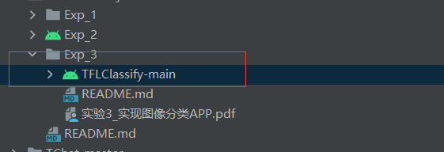

3.点击Gradle Sync，下载相应的gradle wrapper 

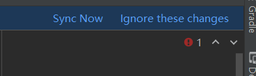

4.下载好后,手机通过USB接口连接开发平台，并设置手机开发者选项允许调试

5.选择真实物理机(或者手机模拟器)运行start模块


6.允许应用获取手机摄像头的权限，得到下述效果图，界面利用随机数表示虚拟的识别结果

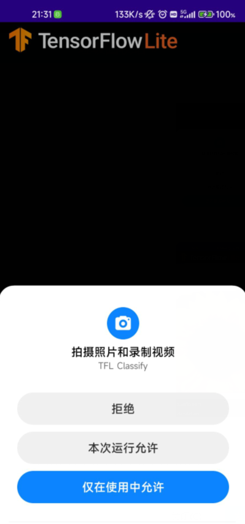

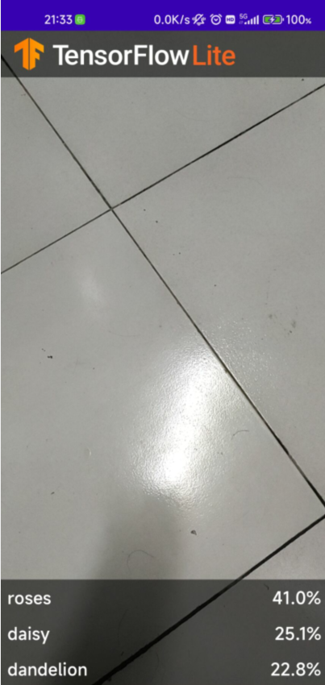

---

#### 向应用中添加TensorFlow Lite

1.选择"start"模块

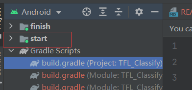

2.File，然后New>Other>TensorFlow Lite Mode

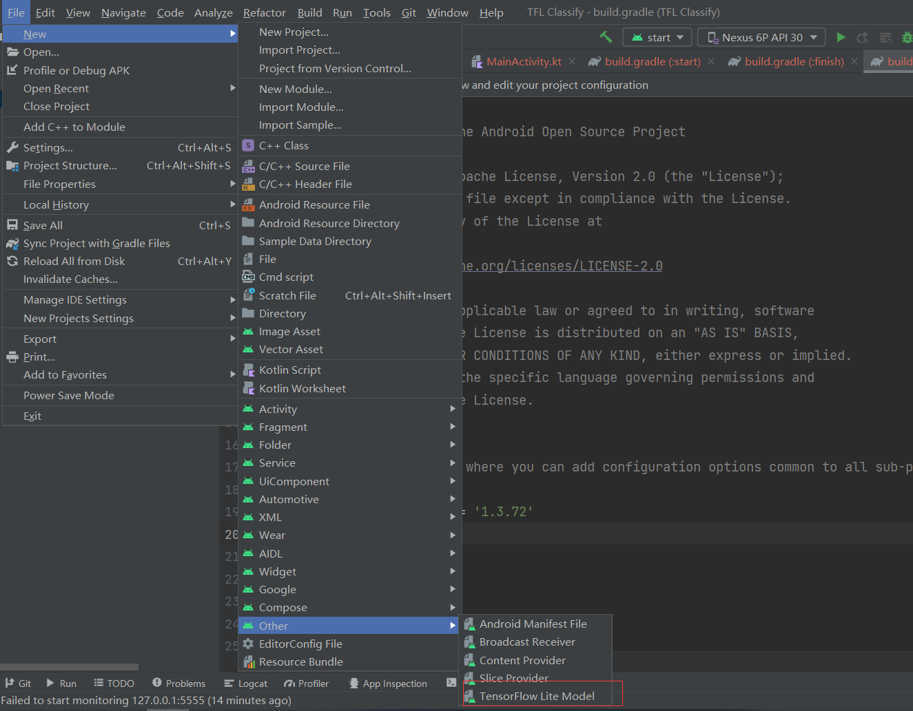

3.选择已经下载的自定义的训练模型。本教程模型训练任务以后完成，这里选择finish模块中ml文件下的FlowerModel.tflite

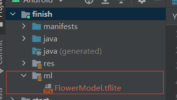

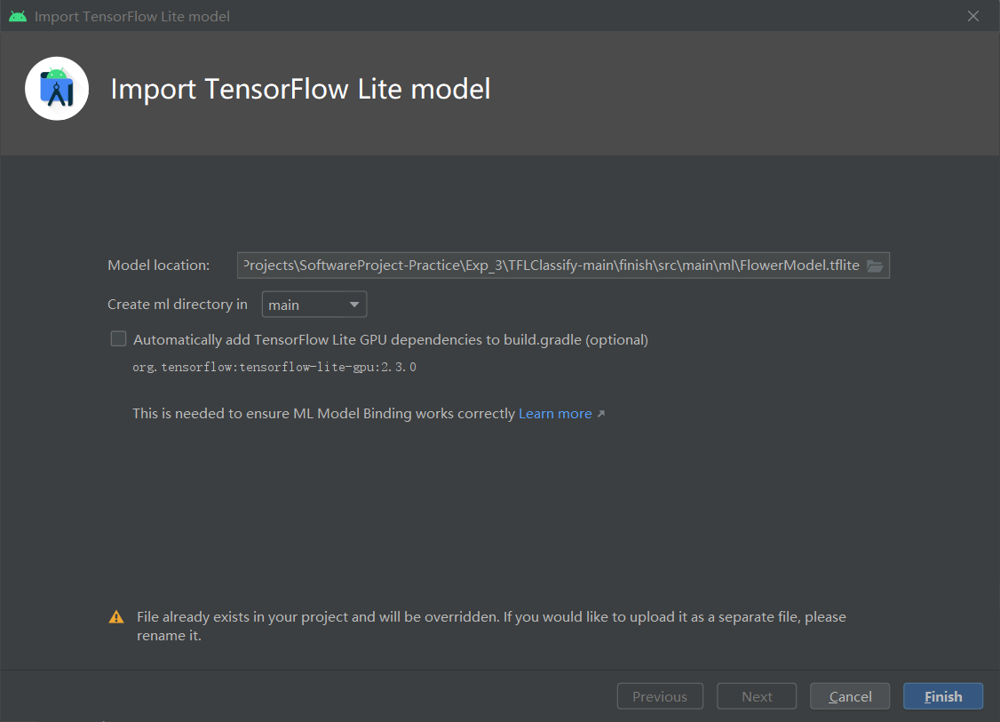

点击“**Finish**”完成模型导入，系统将自动下载模型的依赖包并将依赖项添加至模块的build.gradle文件

4.最终TensorFlow Lite模型被成功导入，并生成摘要信息

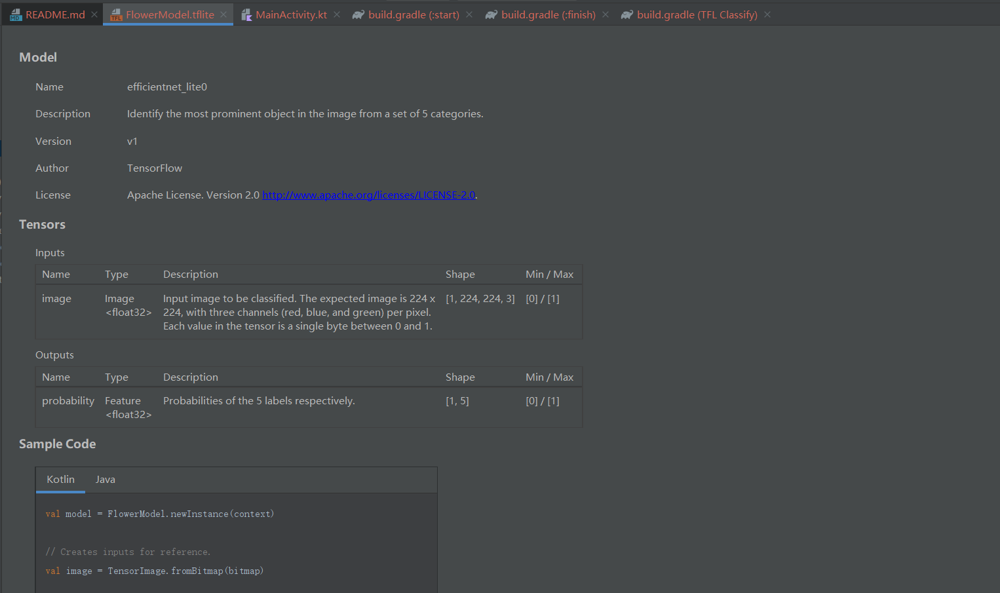

#### start模块中添加代码重新运行APP

1.定位“start”模块**MainActivity.kt**文件的**TODO 1**，添加初始化训练模型的代码

```java
// TODO 1: Add class variable TensorFlow Lite Model
        // Initializing the flowerModel by lazy so that it runs in the same thread when the process
        // method is called.
        private val flowerModel = FlowerModel.newInstance(ctx)
```

2.在CameraX的analyze方法内部，需要将摄像头的输入`ImageProxy`转化为`Bitmap`对象，并进一步转化为`TensorImage` 对象

```java
// TODO 2: Convert Image to Bitmap then to TensorImage
            val tfImage = TensorImage.fromBitmap(toBitmap(imageProxy))
```

3.对图像进行处理并生成结果，主要包含下述操作：

- 按照属性`score`对识别结果按照概率从高到低排序
- 列出最高k种可能的结果，k的结果由常量`MAX_RESULT_DISPLAY`定义

```java
// TODO 3: Process the image using the trained model, sort and pick out the top results
            val outputs = flowerModel.process(tfImage)
                .probabilityAsCategoryList.apply {
                    sortByDescending { it.score } // Sort with highest confidence first
                }.take(MAX_RESULT_DISPLAY) // take the top results
```

4.将识别的结果加入数据对象`Recognition` 中，包含`label`和`score`两个元素。后续将用于`RecyclerView`的数据显示

```java
// TODO 4: Converting the top probability items into a list of recognitions
            for (output in outputs) {
                items.add(Recognition(output.label, output.score))
            }
```

5.将原先用于虚拟显示识别结果的代码注释掉或者删除

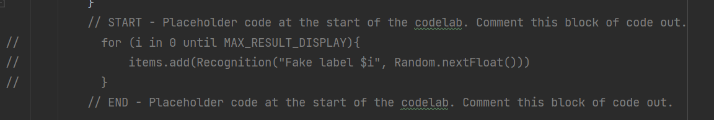

6.以真实物理机(或者手机模拟器)重新运行start模块

**7.最终运行效果**

①**识别玫瑰**

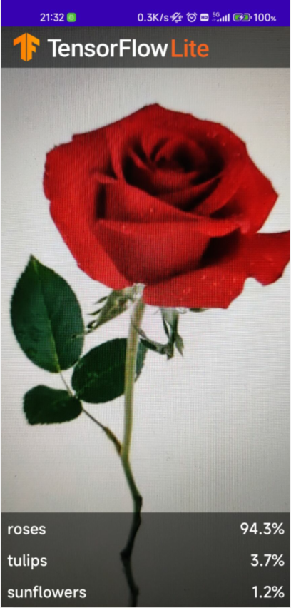

②**识别向日葵**

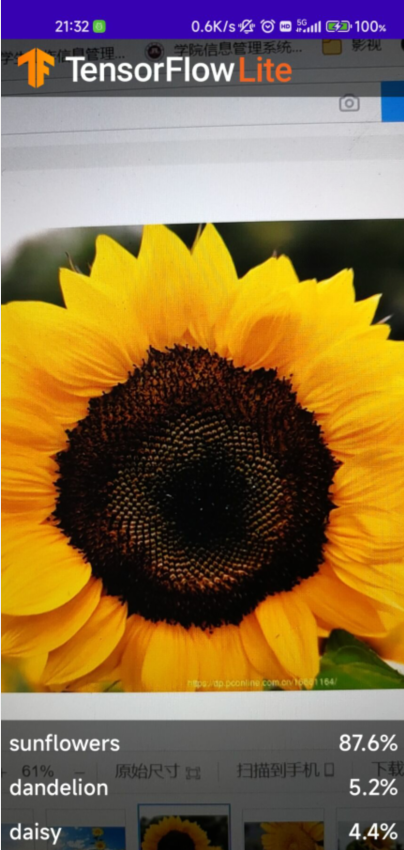

③**识别郁金香**

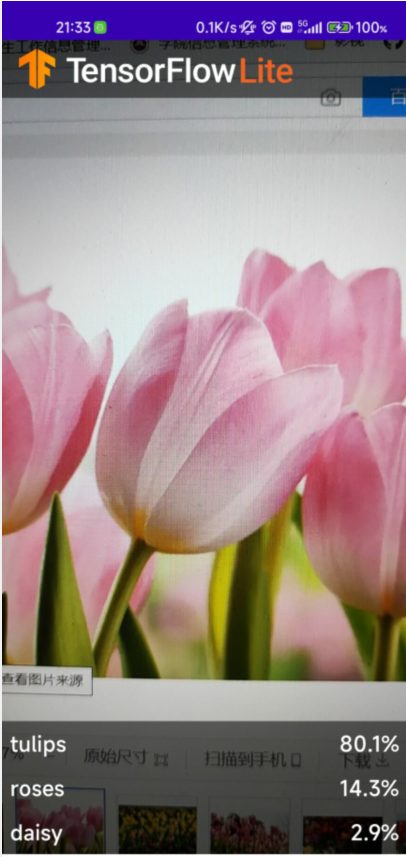


**到此本次实验结束**

参考链接: [基于TensorFlow Lite实现的Android花卉识别应用](https://blog.csdn.net/llfjfz/article/details/123899673)

